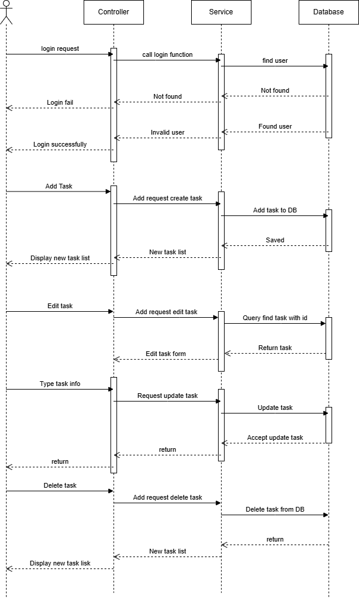
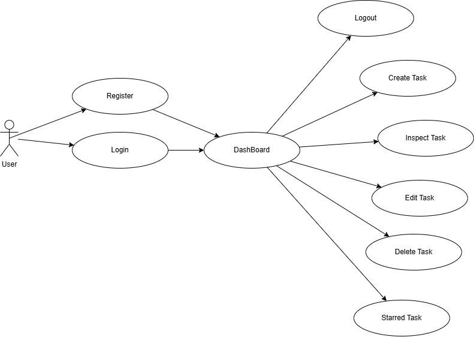
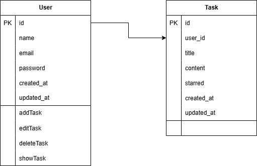
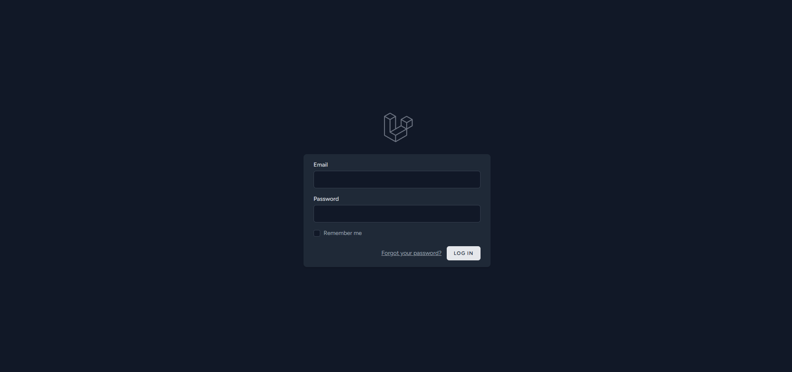
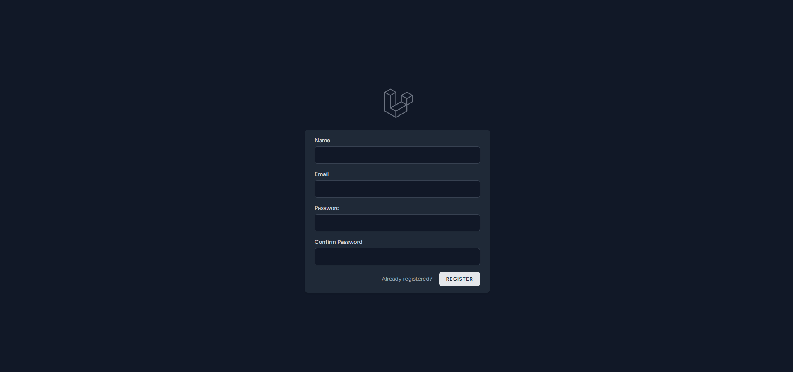
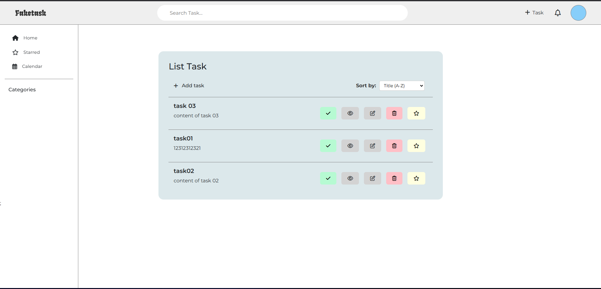
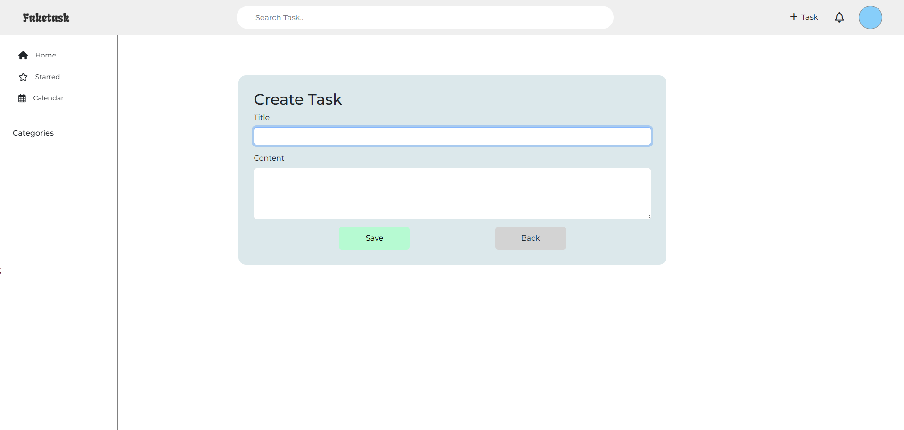
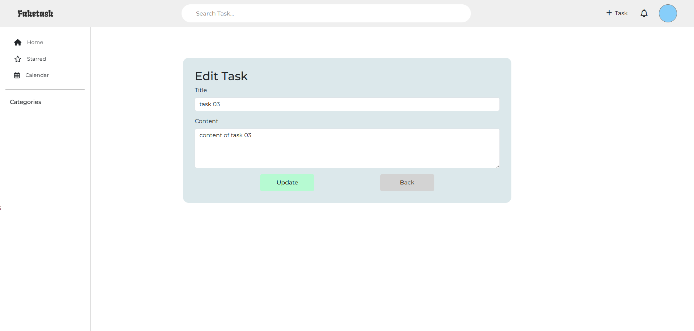
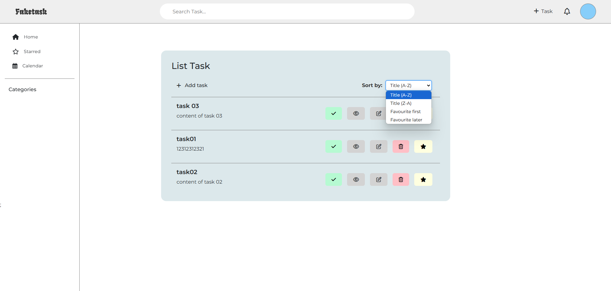

## About Task Manager

Task Manager is a powerful yet simple tool designed to help you organize, track, and manage your daily tasks efficiently. With an intuitive interface, you can create, edit, and prioritize tasks effortlessly. Mark important tasks as starred, set deadlines, and stay on top of your workflow.

Our Task Manager also offers seamless user authentication, allowing you to personalize your experience while keeping your data secure. Whether you're managing work projects or personal to-dos, Task Manager ensures you stay productive and never miss a deadline.

Get started today and take control of your tasks with ease!

## Key Technologies

### 1. Laravel Framework  
- Follows the **MVC architecture**, ensuring well-structured and maintainable code.  
- **Eloquent ORM** for seamless database interactions.  

### 2. Web Technologies & HTTP Request/Response  
- Implements a **routing system** to handle client requests and send appropriate responses.  
- Explores how the client (browser) communicates with the server using **HTTP methods** such as `GET`, `POST`, `PUT`, and `DELETE`.  

### 3. CRUD Operations (Create, Read, Update, Delete)  
- Users can **add, view, edit, and delete** tasks easily through an intuitive interface.  
- Stores and manages data using **MySQL**.  

### 4. Authentication & Authorization  
- Implements **Laravel Authentication** for user registration, login, and session management.  
- Uses **middleware** to control access to specific pages and functionalities.  

### 5. Security  
- Implements **data validation** on both **client-side** and **server-side** to ensure data integrity.  

### 6. Database Management  
- Uses **Eloquent ORM** to interact with MySQL, simplifying database queries.  
- Supports **SQLite** for quick testing and development.  

## Link
1. Link repository: https://github.com/ngnhonk/laravel-task-manager
2. Link readme: https://github.com/ngnhonk/laravel-task-manager/blob/main/README.md
## About me
1. My name: Nguyễn Việt Hùng
2. My email: 22010323@st.phenikaa-uni.edu.vn

## Sequence Diagram


## Use case


## EER Diagram


## How to run on localhost ?
**1. Clone the repository**  
   ```bash
   git clone https://github.com/ngnhonk/laravel-task-manager.git

   cd task-manager
   ```

**2. Install dependencies**  
   ```bash
   composer install
   ```

**3. Create environment file**  
   ```bash
   cp .env.example .env
   ```

**4. Generate application key**  
   ```bash
   php artisan key:generate
   ```

**5. Update database credentials** in `.env`  
   ```
   DB_CONNECTION=mysql
   DB_HOST=localhost
   DB_PORT=3306
   DB_DATABASE=db_name
   DB_USERNAME=db_user
   DB_PASSWORD=db_password
   ```

**6. Run database migrations**  
   ```bash
   php artisan migrate
   ```

**7. Start the application**  
   ```bash
   php artisan serve
   ```
## Layouts

**Login**



**Register**



**Task List**



**Create Task**



**Edit Task**



**Sort By**



**Dashboard**


## License

The Laravel framework is open-sourced software licensed under the [MIT license](https://opensource.org/licenses/MIT).
"# laravel-task-manager" 
